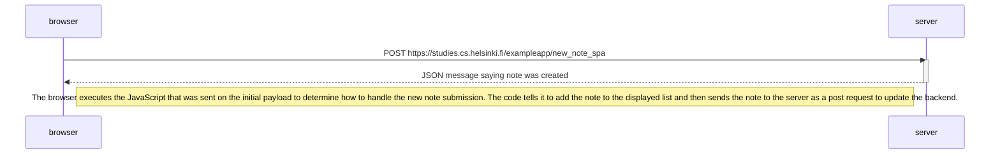

New Note In Single Page App Diagram:

```mermaid
sequenceDiagram
    participant browser
    participant server

    
    browser->>server: POST https://studies.cs.helsinki.fi/exampleapp/new_note_spa
    activate server
    server-->>browser: JSON message saying note was created
    deactivate server

    Note right of browser: The browser executes the JavaScript that was sent on the initial payload to determine how to handle the new note submission. The code tells it to add the note to the displayed list and then sends the note to the server as a post request to update the backend.

```